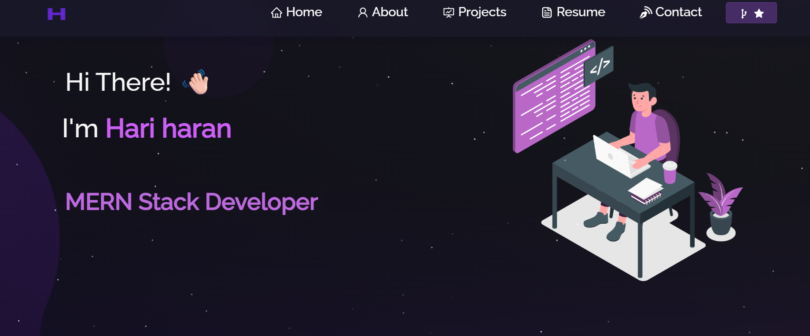

<h2 align="center">
  Portfolio Website - v2.0<br/>
  <a href="https://haricdon.vercel.app/" target="_blank">haricdon.vercel.app</a>
</h2>

<div align="center">
  
</div>

<br/>

<p align="center">
  <a href="https://forthebadge.com">
    
  </a>
  &nbsp;
  <a href="https://forthebadge.com">
    
  </a>
  &nbsp;
  <a href="https://forthebadge.com">
    
  </a>
  &nbsp;
  
  &nbsp;
  
</p>

<h3 align="center">
  🔹
  <a href="https://github.com/harichopper/Portfolio_dynamic/issues">Report Bug</a> &nbsp; &nbsp;
  🔹
  <a href="https://github.com/harichopper/Portfolio_dynamic/issues">Request Feature</a>
</h3>

---

## 📌 TL;DR

You can fork this repo to modify and make changes of your own.  
Please give proper credit by linking back to [harichopper](https://github.com/harichopper/Portfolio_dynamic). Thanks!  

---

## 🚀 Built With

My personal portfolio [haricdon.vercel.app](https://haricdon.vercel.app) features some of my GitHub projects, resume, and technical skills.  

This project was built using the following technologies:

- **React.js**
- **Node.js**
- **Express.js**
- **CSS3**
- **VS Code**
- **Vercel**

---

## ✨ Features

- 📖 Multi-Page Layout  
- 🎨 Styled with React-Bootstrap + CSS (easily customizable)  
- 📱 Fully Responsive Design  

---

## 🛠 Installation and Setup Instructions

Clone this repository and install dependencies. You’ll need `Node.js` and `Git` installed globally on your machine.

```bash
# Clone the repository
git clone https://github.com/harichopper/Portfolio_dynamic.git

# Navigate to project directory
cd Portfolio_dynamic

# Install dependencies
npm install

# Start the app
npm start
